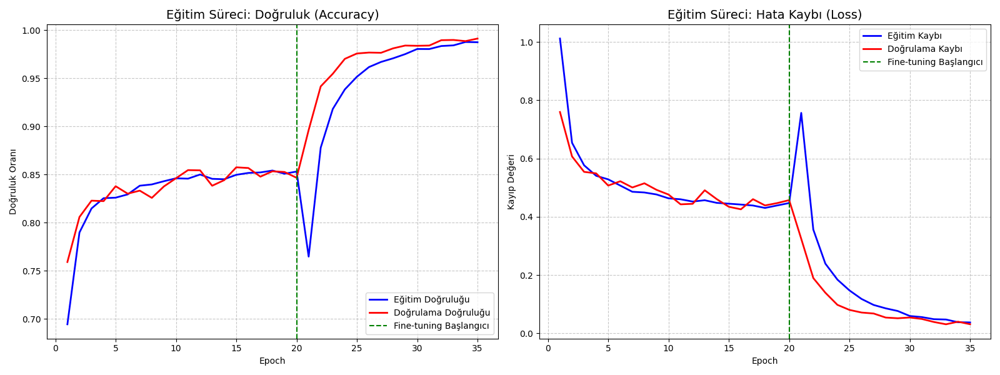

# 🌿 Bitki Hastalıkları Teşhis Sistemi (Derin Öğrenme)

## 📝 Proje Hakkında
Bu proje, küresel tarımda verimliliği tehdit eden bitki hastalıklarını erken teşhis etmek amacıyla geliştirilmiştir. Modern derin öğrenme teknikleri kullanılarak, yaprak fotoğrafları üzerinden bitki türünü ve mevcut hastalığı yüksek doğrulukla analiz eder. 

Çalışma, gerçek dünya veri setleri (PlantVillage) üzerinde eğitilmiş olup, çiftçiler ve tarım uzmanları için bir karar destek sistemi olma potansiyeli taşımaktadır.

## 🚀 Teknik Başarılar ve Metodoloji
- **Mimari:** Güçlü özellik çıkarma yeteneğine sahip **Xception** derin öğrenme mimarisi kullanılmıştır.
- **Eğitim Stratejisi:** 
    - **Transfer Learning:** ImageNet ağırlıkları kullanılarak model ön eğitilmiştir.
    - **Fine-tuning:** Son katmanlar çözülerek veriye özel ince ayar yapılmış ve doğruluk oranı artırılmıştır.
- **Performans:** Yapılan optimizasyonlar sonucunda doğrulama setinde **%99'un üzerinde** başarı elde edilmiştir.
- **Veri Artırma (Augmentation):** Modelin genelleyebilirliğini artırmak için döndürme, yakınlaştırma ve yatay/dikey çevirme gibi teknikler uygulanmıştır.

## 📊 Eğitim Performansı
Eğitim sürecine ait doğruluk ve kayıp grafikleri aşağıda yer almaktadır:

## 📁 Dosya Yapısı
- `train_model.py`: Eğitim ve ince ayar süreçlerini otomatize eden ana script.
- `MODEL_DRIVE_LINK.txt`: 100MB sınırını aşan modellerin (stage1 ve finetuned) Drive indirme bağlantısı.
- `kaggle.json`: Veri setini doğrudan çekmek için gerekli API yapılandırması.

## 🛠 Kurulum ve Çalıştırma
Projeyi yerelinizde çalıştırmak için gerekli kütüphaneleri kurup `python train_model.py` komutunu verebilirsiniz. 
